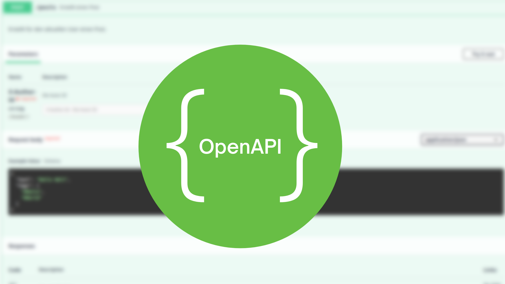

# Spring Boot REST APIs mit OpenAPI

### Bessere RESTful APIs entwerfen, dokumentieren und implementieren dank der Open API Spezifikation



Dieses Repository beinhaltet das Demoprojekt, das in meinem Udemy Kurs
[Spring Boot REST APIs mit OpenAPI](https://www.udemy.com/course/spring-boot-rest-apis-mit-openapi/?referralCode=2351748DE404B3827B6A)
verwendet wird.

## Meine Motivation

Viel zu häufig existieren schlecht dokumentiere und implementierte REST APIs. Mein oben genannter Video Kurs soll
Abhilfe schaffen! Ich möchte euch eine Möglichkeit aufzeigen, wie ihr schneller bessere APIs schreiben und dokumentieren
könnt.

Dabei wird in diesem Kurs ein standardisiertes Framework names OpenAPI verwendet, mit dem wir einfach REST
Schnittstellen formal spezifizieren können. Aus solch einer Spezifikation lassen sich anschließend gewisse Artefakte wie
z.B. Code, Dokumentation oder Tests generieren.

Wir werden im Laufe des Kurses zwei unterschiedliche Anwendungsfälle einer OpenAPI Spezifikation kennen lernen. Im
ersten Fall generieren wir Code, im zweiten Fall nutzen wir es für manuelle Tests.

## Code

Als praktisches Beispiel implementieren wir eine REST API mit Spring Boot und Kotlin. Um RestController nicht manuell
anlegen zu müssen, nutzen wir einen Code-Generator, der anhand einer OpenAPI Spezifikation Interfaces und Modellklassen
generiert. Der Code-Generator wird dabei in den Build-Prozess der Spring Boot Applikation eingebunden, damit bei jedem
neuen Build-Vorgang die generieren Klassen geupdated werden. Dieses Repository beinhaltet die **Kotlin** Variante der
Implementierung.

## API

Der Aufruf von `GET http://localhost:8080/posts` liefert Stub Daten zurück, die wie folgt aussehen:
```json
{
  "posts": [
    {
      "id": "a15097d0-fe31-4210-bc0f-63eda5ab377f",
      "text": "hello world",
      "tags": [
        "#first",
        "#hello"
      ]
    },
    {
      "id": "a6ccb231-77c8-43c7-85dc-d803d003adad",
      "text": "second post",
      "tags": null
    }
  ]
}
```
Die `AuthorsAPI` ist nicht implementiert. 
